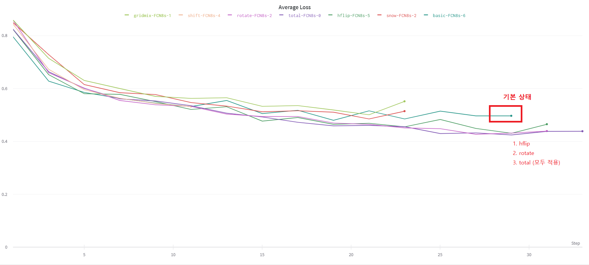
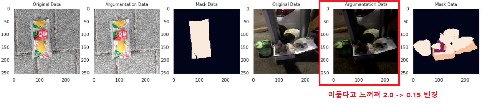
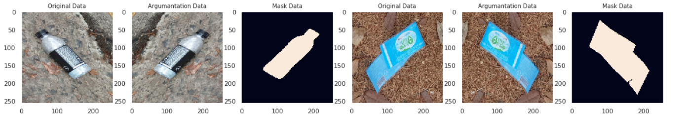
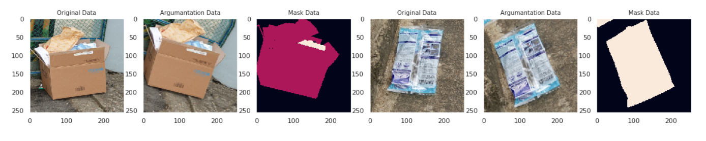
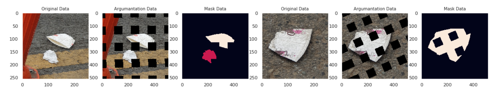
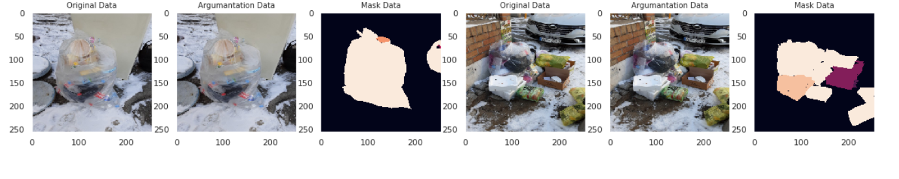

# 어떤 Augmentation 를 적용할 것인가? 

## 데이터에 적용 가능한 Augmentation
### 코드
Train 데이터에만 Augmentation 를 적용하여 실험을 진행하였다.
   ```python 
    A.Compose([
        A.HorizontalFlip(p=0.5),
        A.ShiftScaleRotate(),
        A.RandomBrightnessContrast(brightness_limit=0.15, contrast_limit=0.2, p=0.5),
        ToTensorV2()
    ])
  ```
### 성능
  

## Augmentation 선택 이유

#### RandomBrightnessContrast
   데이터를 보면 실내, 실외, 밤, 낮에 찍은 사진이 있는 뜻이다. 이는 어둡고 밝은 사진이 있다. 데이터의 밝기와 대비를 랜덤으로 조절하여, 밤과 낮의 데이터로 증강 시키면 학습의 성능에 좋은 영향을 줄 것으로 기대된다.
albumentations의 RandomBrightnessContrast 값을 그대로 사용하면 , 어두운 사진이 너무 어둡게 변형되는 것을 알 수 있다. 
이를 해결하기 개선 위해 brightness_limit=0.2 를 brightness_limit=0.15 변경하였다.
 
#### HorizontalFlip
데이터의 객체들은 대체로 위로 보고 있다. 상하 대칭은 물체가 뒤집히기 때문에 오히려 학습 성능이 떨어질 것 같다. 이번에는 좌우 대칭만 적용할 예정이다.

-> 실험으로 확인 시 VerticalFlip 도 성능이 높아짐

#### ShiftScaleRotate
데이터의 객체들은 대체로 위로 보고 있다. 그러나 일부 물체들은 기울어져 있거나 눕혀져 있다.   Rotate 를 -45 ~ 45 도 정도 주면서 데이터를 증강시키는 것도 좋은 방법이다. 그러나 단순한 회전보다 Shift, Scale 기능이 있는 ShiftScaleRotate가 성능에 좋은 영향을 줄 것 같다.


### GridMask
데이터의 일부 영역을 지워주면, 데이터 학습시 오버피팅을 방지하게 되어 일반화 성능을 높여준다. Cutout를 사용하면 이미지의 중요한 특징도 같이 지워진다. 이번 실험에서는 작은 영역을 지워주는 GridMask 를 적용할 예정이다.


-> 성능이 낮게 나옴( 적용X)

### 눈 (Snow)
데이터를 보면, 눈이 배경인 사진이 꽤 된다. Snow 기능을 넣어야 할까 ??
그러나 테스트 데이터에는 없다? RandomSnow 적용할 것인가? 말 것인가?
-> 성능이 떨어짐 (적용 X)


