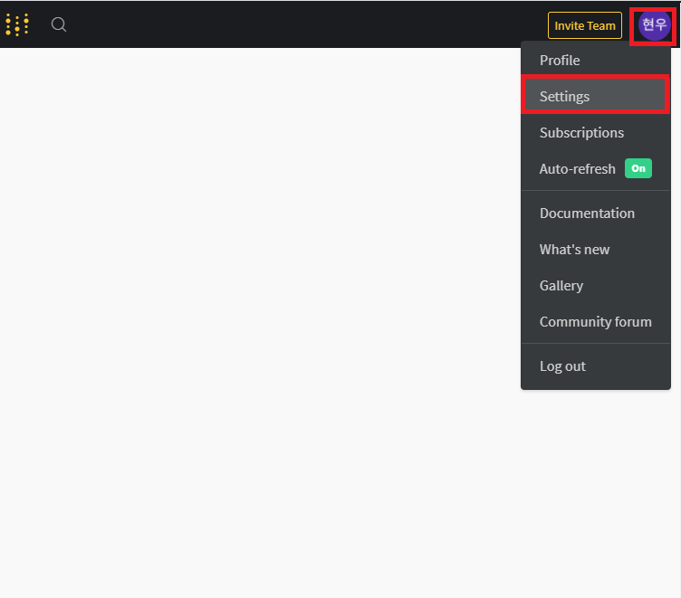
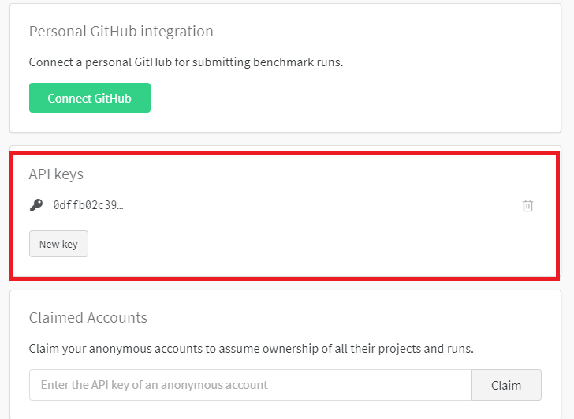

# Wandb 사용하기

### Wandb 가입 및 설치


1.  wandb.ai (http://wandb.ai) 사이트 회원 가입하기 

2. Key 값 가져오기 
      > wandb.ai 사이트-> 내 계정 -> Settings -> API Keys 복사 (키 값이 없는 경우 키를 생성)
      
      > 
      
      > 

3. wandb 설치 
      > !pip install wandb

4. wandb 로그인 (한번만 실행)
      > ! wandb login
      
      > -> 2에서 복사한 Key 값 붙여넣고 엔터 (Key 값은 터미널 화면에 보이지 않음)


### Wandb 코드 삽입 


```python

import wandb

# 1. wandb 초기화 
wandb.init(project='프로젝트이름' )


for batch_idx, (data, target) in enumerate(train_loader):

    # 2. 로그 정보 서버에 전달 
    wandb.log({"loss": loss, "acc": acc})

```