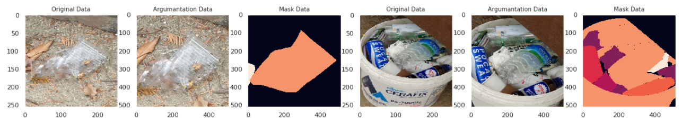
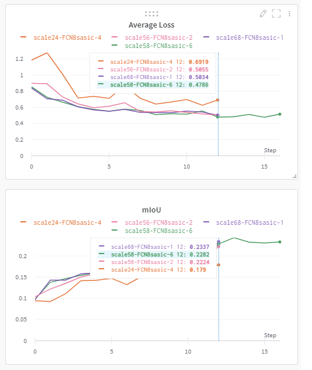
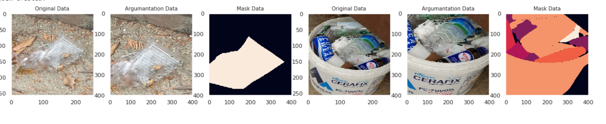
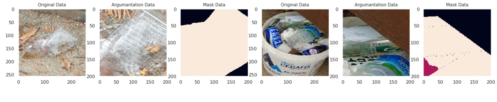

# 이미지를 어떻게 자를 것인가? 
이미지를 무작위로 자르면 데이터 증강에 도움이 된다. 그 중 성능이 향상된 RandomResizedCrop, CropNonEmptyMaskIfExist 실험해보자.

## RandomResizedCrop
```python
A.RandomResizedCrop(512,512,scale = (0.5,0.8), always_apply=True,p=1)
```
이미지에서 물체가 크게 보이므로 데이터 증강에 도움이 된다. 
 

## RandomResizedCrop (스케일 조정)
```python
RandomResizedCrop(512,512,scale = (0.5,0.8))
RandomResizedCrop(512,512,scale = (0.6,0.8))
RandomResizedCrop(512,512,scale = (0.4,0.6))
RandomResizedCrop(512,512,scale = (0.2,0.4))
```
scale = (0.5,0.8) 와 scale = (0.6,0.8) 비슷하고 나머지는 Loss 값이 살짝 높다. 
 


## CropNonEmptyMaskIfExist
마스크 영역을 자르기 때문에 RandomResizedCrop 보다 데이터를 정확하게 자른다. 이론상 mask 영역을 정확하게 자르기 때문에 좋은 성능이 예상함. 그러나 개인적으로 이미지를 직접 확인할때는 RandomResizedCrop 물체의 크기를 적당하게 잘 자르는 것 같음   -> 이미지를 400, 245 으로 잘랐을때 둘다 성능이 낮게 나옴 특히  256으로 자른는 것은 성능이 아주 낮게 나옴

```python 
A.CropNonEmptyMaskIfExists(height=400, width=400)
A.resize(512,512)
```


 
```python 
A.CropNonEmptyMaskIfExists(height=256, width=256)
A.resize(512,512)
```
 
